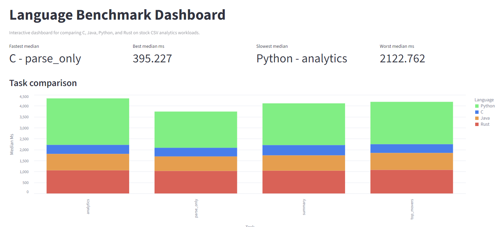

# Cross Language Benchmark Suite

A cross-language benchmark project that compares CSV-based stock analytics workloads across Python, C, Java, and Rust, then visualizes the results in an interactive Streamlit dashboard.

## Project goal
The goal of this project is to measure how four language implementations perform on the same stock-price CSV workloads and to compare their runtime behavior with consistent benchmark tasks. The project records repeated runs, summarizes the results, and presents the findings in a dashboard so the tradeoffs are easy to inspect.

## Live dashboard
View the deployed dashboard here: [Streamlit](https://crosslanguagebenchmarksuite.streamlit.app/).

## Dataset
Place `World-Stock-Prices-Dataset.csv` in `data/raw/`.

Source: [Kaggle: World Stock Prices Daily Updating](https://www.kaggle.com/datasets/nelgiriyewithana/world-stock-prices-daily-updating/data)

## What this project does
- Parses the same stock-price CSV in four language implementations.
- Runs four benchmark tasks: `parse_only`, `summary`, `analytics`, and `top_movers`.
- Records repeated runtimes into `results/benchmark_results.csv`.
- Builds a summary table in `results/summary_table.csv`.
- Launches a Streamlit dashboard to compare runtime, throughput, and speedup.

## Benchmark methodology
Each language was tested on the same dataset and the same task set, with repeated runs collected in the results files. The benchmark output includes elapsed time, rows processed, invalid rows, preview count, and run number for each execution. Median, mean, standard deviation, and speedup versus Python were then calculated in the summary table.

The four tasks represent different workload shapes: `parse_only` focuses on reading and parsing, `summary` emphasizes aggregation, `analytics` represents heavier computation over the full dataset, and `top_movers` measures a ranking-style workload.

## System specifications
- Operating system: Windows 64-bit.
- Device: MSI laptop.
- Processor: 13th Gen Intel Core i7-13620H (2.40 GHz).
- Installed RAM: 16.0 GB (15.7 GB usable).
- Graphics: NVIDIA GeForce RTX 4050 Laptop GPU (6 GB), Intel UHD Graphics (128 MB).
- Editor: Visual Studio Code.
- Python: 3.14.0.
- Java: 17.0.6.
- Maven: 3.9.16.
- Rust/Cargo: 1.95.0.
- GNU Make: 4.4.1.
- GCC: 14.2.0.

## Dashboard preview
[](images/dashboard_image.png)

## Key findings
- C was the fastest language on every task.
- Python was the slowest language on every task.
- Java consistently beat Rust, which was different from the original expectation.
- Run-to-run variation was modest for the compiled languages and highest for Python.

## Interpretation
The benchmark results show a clear performance split between Python and the compiled languages. C delivered the best runtime across every task, Java stayed in second place, Rust came third, and Python was last.

The most important interpretation detail is that the original expected order was not fully correct in the middle positions. Instead of Rust finishing ahead of Java, Java was consistently faster than Rust across all four benchmark tasks.

Speedup values should be read relative to Python, so a higher speedup means a faster implementation for the same workload. Because this benchmark reflects one machine, one dataset, and one workload design, the results should be treated as evidence for this project rather than a universal ranking of programming languages.

## Project structure
```text
.
├── data/
│   └── raw/
├── python/
├── c/
├── java/
├── rust/
├── scripts/
├── results/
└── dashboard/
```

## Quick start
### 1. Add the dataset
Put `World-Stock-Prices-Dataset.csv` in `data/raw/`.

### 2. Run the Python reference benchmark
```bash
python python/main.py --input data/raw/World-Stock-Prices-Dataset.csv --task parse_only
```

### 3. Run all benchmarks
Windows PowerShell:
```powershell
python scripts/run_benchmarks.py --input data/raw/World-Stock-Prices-Dataset.csv --runs 5
```

### 4. Launch dashboard locally
```bash
python -m streamlit run dashboard/app.py
```

## Output files
- `results/benchmark_results.csv`: raw timing results for every run.
- `results/summary_table.csv`: aggregated metrics such as median runtime, mean runtime, standard deviation, and speedup versus Python.